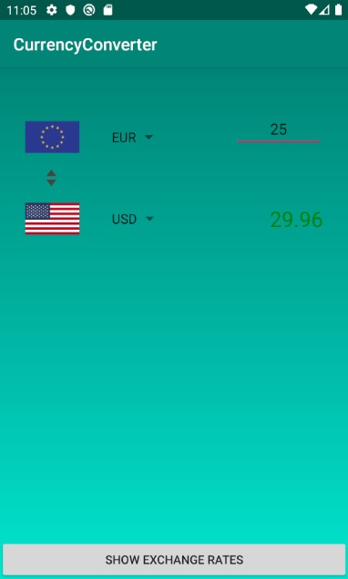
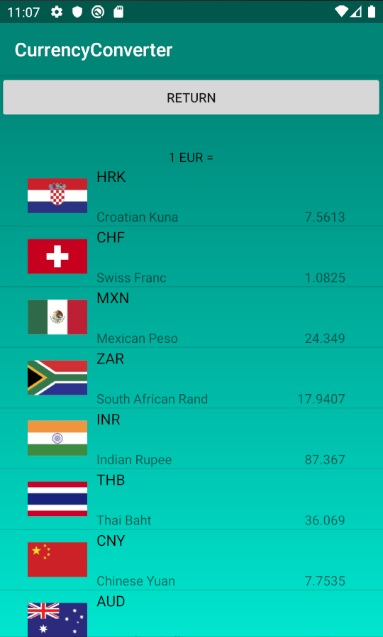

## Currency Converter - converts currencies and shows current rates
Original code written in 2018 for a school project; updated in 02/2021 for Android 10

Written in Kotlin for Android 10 (SDK 29). Minimum Android 5 (SDK 21).

